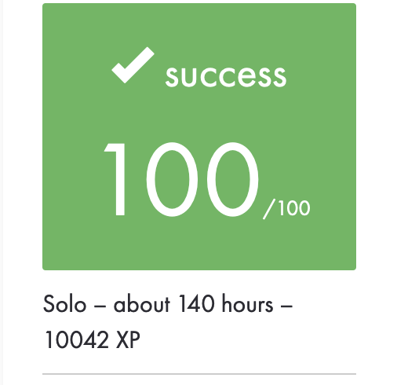

# ft_container

Reimplementation of STL containers such as vector, stack and map. 42 School project.

	

	
	
	
	

	
	
	
	

	
	<!--  -->
	<!--  -->

## Original purpose

`ft_container` was a 'basic' replication of features based on **standard c++ library**. It follows the guidlines of _cplusplus.com_ and _cppreference.com_ and when it diverged I choosed to implement the behavior of school's Macintosh. The main goal was to reproduce exactly the school's version and implementation of the containers.

The tests from this repository or by using those from my `gunner_tester` are comparing the output of my code with the one for the local std. Those were reviewed by other students.

## Constraints

The code must be **readable** and **easy to understand**.

The code must be written in **standard c++ 98** version for pedagogical reasons. All classes must be in **'Orthodox Canonical'** form whenever it's possible. Only `new` and `delete` are allowed, no `malloc()` and `free()`. `printf` is also forbidden.

It must compile with those flags : `-Wall -Wextra -Werror -std=c++98`.

The keyword `friends` is forbidden except for specific cases (ex : `std::value_compare`).

Execution time shouldn't be more than 20 times slower compared to the original.

## Implementation matters

As the subject requires specific functions and objects for the project to run and works, we had to recode them. Those are not part of any containers and for this they have been stored in `utils` :
 - `iterator_traits`
 - `reverse_iterator`
 - `enable_if` (authorized even if it's C++ 11)
 - `is_integral`
 - `equal`
 - `lexicographical_compare`
 - `std::pair`
 - `std::make_pair`

## Requirements

Each container should be used with the same templates than the official; each container has an implementation of his `iterator`. `std::allocator` must be used for memory management.

## Features and choices

For the `std::map` I choosed **A.V.L.** as *binary tree* system. It's efficient enough and an interesting challenge as it is in a recursive form. Otherwise iterator's map is in a iterative mode to avoid overflow problems.

`const` and `non-const` values must be comparable as requires in the subject. It's implementation define in the standard C++ 98.

I used a tester named **gunner_tester** to avoid a simple main file with thousand of lines. He should be put in the directory. However, I created a simple test main in this repository to meet the demands of the correction but it's only a showcase.

